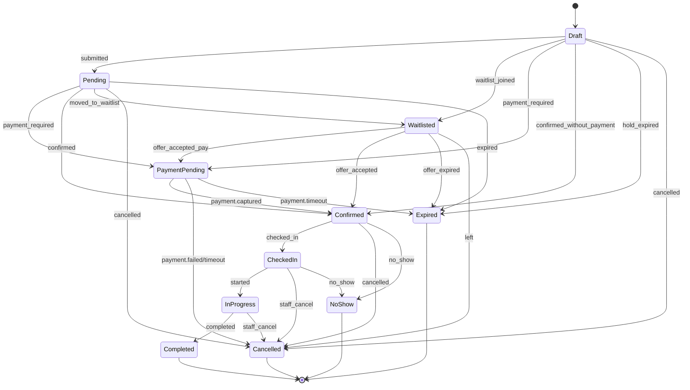
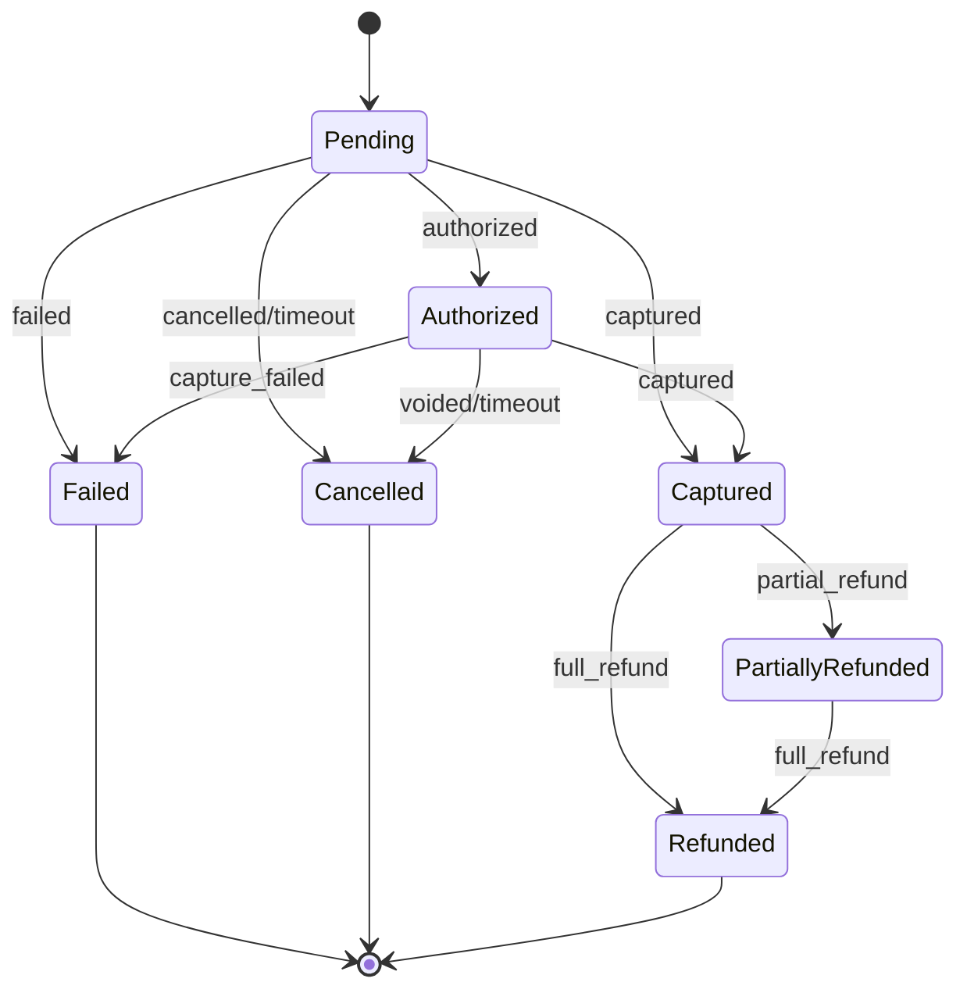
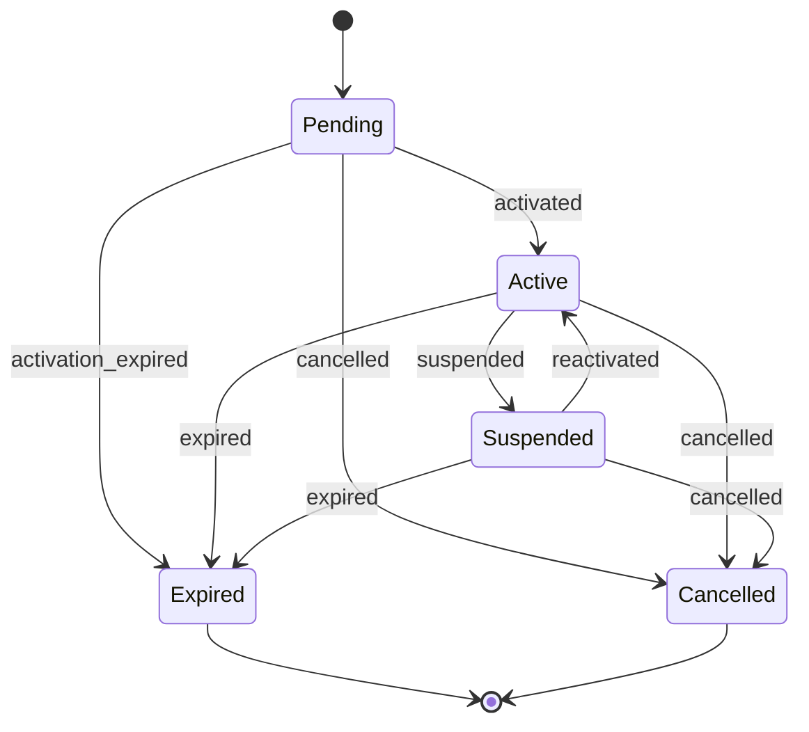
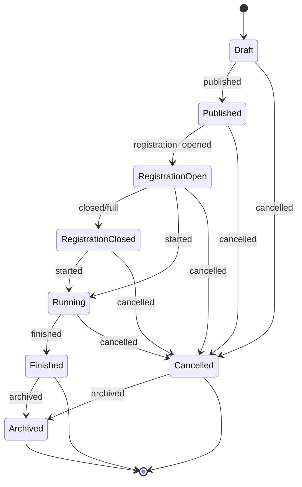
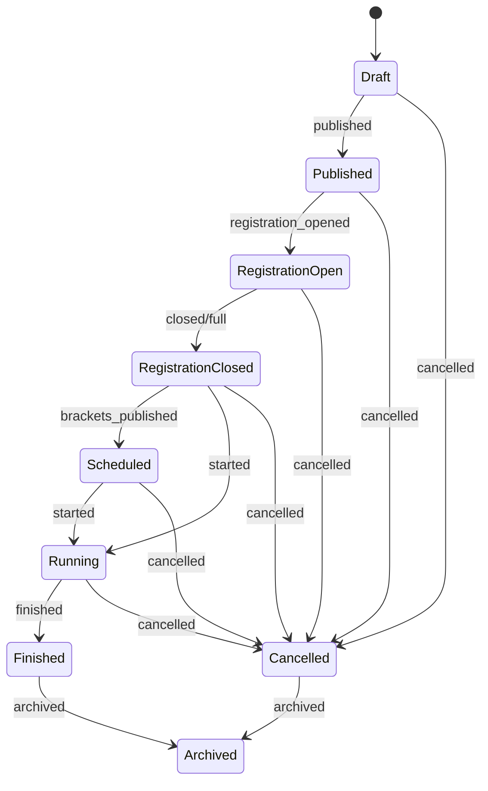
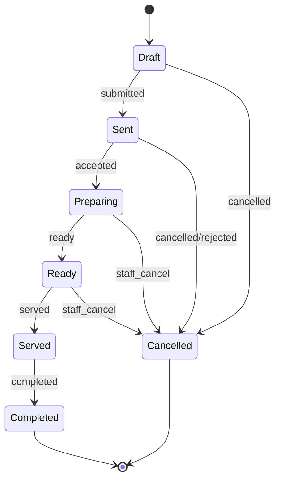
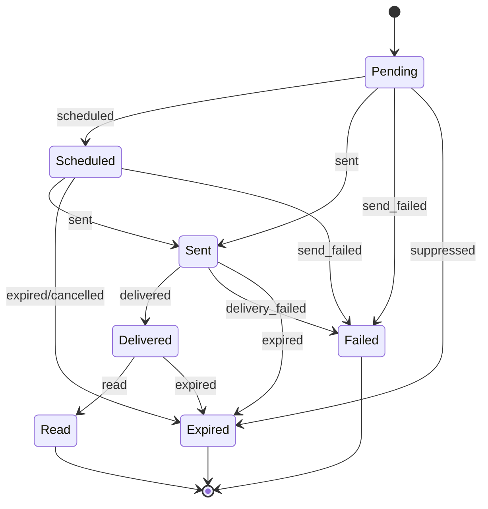
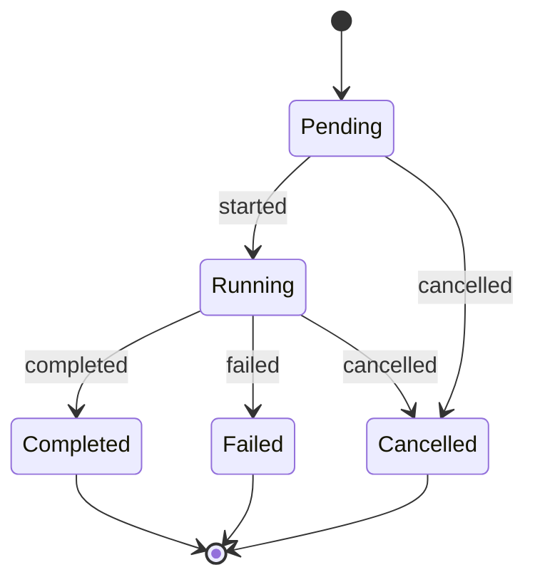
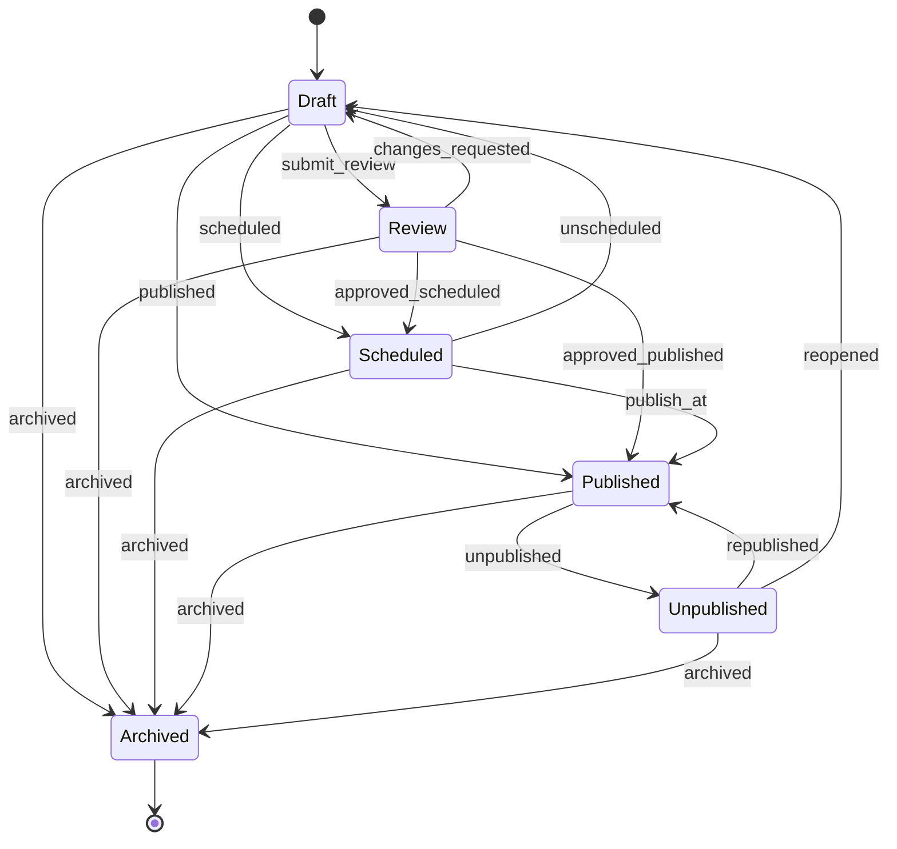
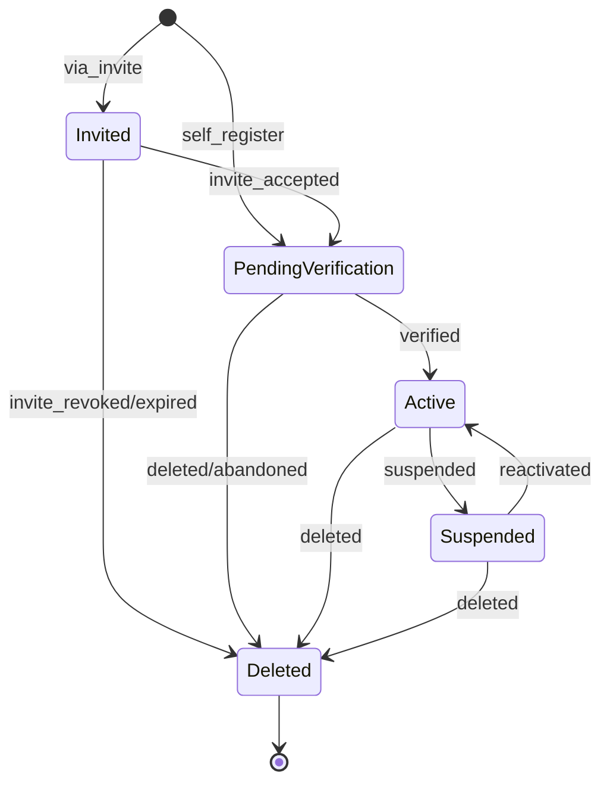

# IKON_ECOSYSTEM — State Machines

Fuente de verdad: documentación funcional `docs/00`–`docs/53`, diagramas de flujo y `docs/rules/business-rules.md`.

Este documento define las **máquinas de estados oficiales** de los agregados principales.

No contiene código, SQL ni contratos de API.

Nomenclatura canónica de estados: **inglés** (implementación).  
Equivalencias en español documentadas entre paréntesis cuando aplica.

---

# Principios transversales

1. Toda transición es **explícita**: no existen cambios implícitos de estado.
2. Los estados finales no admiten nuevas transiciones de negocio (salvo correcciones auditadas excepcionales definidas abajo).
3. Las transiciones deben ser **deterministas**: mismo estado + mismo evento ⇒ mismo resultado.
4. Las reglas `BR-*` prevalecen sobre cualquier interpretación informal.
5. Un bloqueo temporal de recurso **no** es un estado de `BOOKING` hasta que exista el agregado.

---

# 1. BOOKING

## Nombre

`BOOKING`

## Descripción

Ciclo de vida de una reserva unificada del Booking Engine (golf, pádel, fútbol 7, billar, dardos, restaurante, eventos/plazas y cualquier `RESOURCE`).

## Estado inicial

`Draft`

## Estados posibles

| Estado | Equivalencia documental | Tipo |
|---|---|---|
| `Draft` | Borrador / pre-persistencia con bloqueo temporal | Intermedio |
| `Pending` | Pendiente | Intermedio |
| `Waitlisted` | Lista de espera | Intermedio |
| `PaymentPending` | Pendiente de pago | Intermedio |
| `Confirmed` | Confirmada | Intermedio |
| `CheckedIn` | Check-in realizado | Intermedio |
| `InProgress` | En curso | Intermedio |
| `Completed` | Finalizada | Final |
| `Cancelled` | Cancelada | Final |
| `NoShow` | No Show | Final |
| `Expired` | Expirada (bloqueo/pago/waitlist vencidos) | Final |

## Estados finales

`Completed`, `Cancelled`, `NoShow`, `Expired`

## Transiciones válidas

| Desde | Hasta | Evento |
|---|---|---|
| `Draft` | `Pending` | `booking.submitted` |
| `Draft` | `Waitlisted` | `booking.waitlist_joined` |
| `Draft` | `PaymentPending` | `booking.payment_required` |
| `Draft` | `Confirmed` | `booking.confirmed_without_payment` |
| `Draft` | `Expired` | `booking.hold_expired` |
| `Draft` | `Cancelled` | `booking.cancelled_by_user` / `booking.cancelled_by_system` |
| `Pending` | `PaymentPending` | `booking.payment_required` |
| `Pending` | `Confirmed` | `booking.confirmed` |
| `Pending` | `Waitlisted` | `booking.moved_to_waitlist` |
| `Pending` | `Cancelled` | `booking.cancelled_*` |
| `Pending` | `Expired` | `booking.expired` |
| `Waitlisted` | `PaymentPending` | `waitlist.offer_accepted_payment_required` |
| `Waitlisted` | `Confirmed` | `waitlist.offer_accepted` |
| `Waitlisted` | `Expired` | `waitlist.offer_expired` |
| `Waitlisted` | `Cancelled` | `waitlist.left` / `booking.cancelled_*` |
| `PaymentPending` | `Confirmed` | `payment.captured` |
| `PaymentPending` | `Cancelled` | `payment.failed` / `payment.timeout` / `booking.cancelled_*` |
| `PaymentPending` | `Expired` | `payment.timeout` (si política marca expiración) |
| `Confirmed` | `CheckedIn` | `booking.checked_in` |
| `Confirmed` | `Cancelled` | `booking.cancelled_*` |
| `Confirmed` | `NoShow` | `booking.marked_no_show` |
| `CheckedIn` | `InProgress` | `booking.started` |
| `CheckedIn` | `Cancelled` | `booking.cancelled_by_staff` (excepcional) |
| `CheckedIn` | `NoShow` | `booking.marked_no_show` (si no inicia servicio) |
| `InProgress` | `Completed` | `booking.completed` |
| `InProgress` | `Cancelled` | `booking.cancelled_by_staff` (excepcional, con auditoría) |

## Transiciones prohibidas

* `Completed` → cualquier estado.
* `Cancelled` → `Confirmed` / `CheckedIn` / `InProgress` (reapertura: crear nueva reserva).
* `NoShow` → `CheckedIn` / `InProgress`.
* `Expired` → `Confirmed` sin nuevo flujo.
* `PaymentPending` → `Confirmed` **sin** `payment.captured` (o equivalente de cobro validado).
* Cualquier estado → `Confirmed` saltándose validaciones de disponibilidad/permisos/membresía.
* `Waitlisted` → `InProgress` directamente.

## Reglas especiales

* **Availability-blocking** (ocupan el RESOURCE; no pueden solaparse): `Draft` (con hold), `Pending`, `PaymentPending`, `Confirmed`, `CheckedIn`, `InProgress`.
* **Non-blocking:** `Waitlisted`, `Completed`, `Cancelled`, `NoShow`, `Expired`.
* Hold temporal TTL default **15 minutos** (configurable); ver BR-0037.
* Waitlist offer TTL default **15 minutos**; ver BR-0035.
* Si el recurso requiere pago anticipado, `Confirmed` solo tras `PAYMENT.Captured`.
* Cancelación libera disponibilidad del `RESOURCE` inmediatamente.
* Check-in actualiza reserva y, cuando aplique, recurso/mesa.
* No Show aplica política del club (penalización/analytics).
* Ownership: BR-0016 / `permission-matrix.md`.

## Casos límite

* Doble clic / última plaza: solo una reserva alcanza `Confirmed`/`PaymentPending` (consistencia concurrente).
* Pago rechazado tras hold: `PaymentPending` → `Cancelled`/`Expired` + liberación de bloqueo.
* Cierre de campo/restaurante: reservas `Confirmed` pueden pasar a `Cancelled` con notificación.
* Lista de espera: oferta con ventana de aceptación; si caduca → `Expired` y se ofrece al siguiente.

## Relacionado con

`BR-0016`, `BR-0030`, `BR-0031`, `BR-0032`, `BR-0034`, `BR-0035`, `BR-0037`, `BR-0038`, `BR-0040`, `BR-0041`, `BR-0042`, `BR-0045`, `BR-0110`, `BR-0115`, `BR-0151`, `BR-0158`, `BR-0159`

---

# 2. PAYMENT

## Nombre

`PAYMENT`

## Descripción

Ciclo de vida de un cobro independiente asociado a reserva, pedido, membresía, evento o torneo.

## Estado inicial

`Pending`

## Estados posibles

| Estado | Equivalencia documental | Tipo |
|---|---|---|
| `Pending` | Pendiente | Intermedio |
| `Authorized` | Procesando / autorizado | Intermedio |
| `Captured` | Completado | Final (salvo reembolso) |
| `Failed` | Fallido | Final |
| `Cancelled` | Cancelado | Final |
| `Refunded` | Reembolsado | Final |
| `PartiallyRefunded` | Reembolso parcial | Intermedio/Final condicional |

## Estados finales

`Failed`, `Cancelled`, `Refunded`  
`Captured` es terminal para cobro salvo transición a reembolso.  
`PartiallyRefunded` es terminal si no quedan importes reembolsables; en caso contrario permanece hasta `Refunded`.

## Transiciones válidas

| Desde | Hasta | Evento |
|---|---|---|
| `Pending` | `Authorized` | `payment.authorized` |
| `Pending` | `Captured` | `payment.captured` (captura directa) |
| `Pending` | `Failed` | `payment.failed` |
| `Pending` | `Cancelled` | `payment.cancelled` / `payment.timeout` |
| `Authorized` | `Captured` | `payment.captured` |
| `Authorized` | `Failed` | `payment.capture_failed` |
| `Authorized` | `Cancelled` | `payment.voided` / `payment.timeout` |
| `Captured` | `PartiallyRefunded` | `refund.partial_completed` |
| `Captured` | `Refunded` | `refund.full_completed` |
| `PartiallyRefunded` | `PartiallyRefunded` | `refund.partial_completed` (acumulativo) |
| `PartiallyRefunded` | `Refunded` | `refund.full_completed` |

## Transiciones prohibidas

* `Failed` / `Cancelled` → `Captured`.
* `Refunded` → `Captured`.
* `Captured` → `Pending`.
* Reembolso sin `Captured` previo (o captura equivalente).
* Doble captura del mismo `PAYMENT`.

## Reglas especiales

* Importes mostrados al usuario = importes finales.
* Reembolsos respetan política de cancelación.
* Toda transición deja trazabilidad auditable.
* Confirmación de `BOOKING`/`ORDER`/`MEMBERSHIP` depende de `Captured` cuando el cobro es requisito.

## Casos límite

* Timeout de proveedor: `Pending`/`Authorized` → `Cancelled` o `Failed` según política; liberar holds de booking.
* Webhook duplicado: transición idempotente (sin doble cobro).
* Reembolso parcial múltiple hasta agotar importe capturado.

## Relacionado con

`BR-0038`, `BR-0085`, `BR-0097`, `BR-0109`, `BR-0110`, `BR-0111`, `BR-0112`, `BR-0113`, `BR-0114`, `BR-0115`, `BR-0116`, `BR-0151`, `BR-0158`

---

# 3. MEMBERSHIP

## Nombre

`MEMBERSHIP`

## Descripción

Relación del usuario con un `MEMBERSHIP_PLAN` del club.

## Estado inicial

`Pending`

## Estados posibles

| Estado | Tipo |
|---|---|
| `Pending` | Intermedio |
| `Active` | Intermedio |
| `Suspended` | Intermedio |
| `Expired` | Final (reactivable vía nueva/renovación) |
| `Cancelled` | Final |

## Estados finales

`Expired`, `Cancelled`  
(`Expired` puede dar lugar a una **nueva** membresía o renovación; no reescribe el agregado cancelado/expirado.)

## Transiciones válidas

| Desde | Hasta | Evento |
|---|---|---|
| `Pending` | `Active` | `membership.activated` / `payment.captured` |
| `Pending` | `Cancelled` | `membership.application_cancelled` |
| `Pending` | `Expired` | `membership.activation_expired` |
| `Active` | `Suspended` | `membership.suspended` |
| `Active` | `Expired` | `membership.expired` |
| `Active` | `Cancelled` | `membership.cancelled` |
| `Suspended` | `Active` | `membership.reactivated` |
| `Suspended` | `Cancelled` | `membership.cancelled` |
| `Suspended` | `Expired` | `membership.expired` |

## Transiciones prohibidas

* `Cancelled` → `Active` (crear nueva `MEMBERSHIP`).
* `Expired` → `Active` sobre el mismo registro sin evento de renovación explícito que cree continuidad auditada.
* Beneficios de socio aplicados fuera de `Active`.

## Reglas especiales

* Beneficios exclusivos solo con `Active`.
* Renovación con pago: no `Active` hasta `payment.captured` cuando aplique.
* Usuario suspendido (`USER`) puede coexistir con membresía; las reservas respetan ambos estados.

## Casos límite

* Pago de renovación fallido: permanece `Active` hasta fecha de fin o pasa a `Expired` según política del club (configurable, no ambigua por club).
* Vinculación de membresía existente a cuenta nueva: solo con verificación controlada.

## Relacionado con

`BR-0022`, `BR-0023`, `BR-0024`, `BR-0025`, `BR-0026`, `BR-0027`, `BR-0029`, `BR-0039`, `BR-0008`

---

# 4. EVENT

## Nombre

`EVENT`

## Descripción

Ciclo de vida de un evento del club (deportivo, gastronómico, social, familiar o corporativo).

## Estado inicial

`Draft`

## Estados posibles

| Estado | Equivalencia aproximada | Tipo |
|---|---|---|
| `Draft` | Borrador | Intermedio |
| `Published` | Publicado / Programado | Intermedio |
| `RegistrationOpen` | Inscripciones abiertas | Intermedio |
| `RegistrationClosed` | Inscripciones cerradas / Completo | Intermedio |
| `Running` | En curso | Intermedio |
| `Finished` | Finalizado | Final |
| `Cancelled` | Cancelado | Final |
| `Archived` | Archivado | Final |

## Estados finales

`Finished`, `Cancelled`, `Archived`

## Transiciones válidas

| Desde | Hasta | Evento |
|---|---|---|
| `Draft` | `Published` | `event.published` |
| `Draft` | `Cancelled` | `event.cancelled` |
| `Published` | `RegistrationOpen` | `event.registration_opened` |
| `Published` | `Cancelled` | `event.cancelled` |
| `RegistrationOpen` | `RegistrationClosed` | `event.registration_closed` / `event.capacity_reached` |
| `RegistrationOpen` | `Running` | `event.started` (si el club permite inicio con registro aún abierto) |
| `RegistrationOpen` | `Cancelled` | `event.cancelled` |
| `RegistrationClosed` | `Running` | `event.started` |
| `RegistrationClosed` | `Cancelled` | `event.cancelled` |
| `Running` | `Finished` | `event.finished` |
| `Running` | `Cancelled` | `event.cancelled` (excepcional) |
| `Finished` | `Archived` | `event.archived` |
| `Cancelled` | `Archived` | `event.archived` |

## Transiciones prohibidas

* Vender/confirmar plazas por encima del aforo en cualquier estado.
* `Draft` → `Running` (debe publicarse/abrirse registro según política).
* `Archived` → `Published`.
* Eventos privados visibles fuera de audiencia autorizada.

## Reglas especiales

* `EVENT` ≠ `EXPERIENCE` (pueden relacionarse).
* Pago previo puede ser obligatorio para confirmar inscripción.
* Cancelación libera plazas y notifica.
* Socios pueden tener prioridad de inscripción.

## Casos límite

* Aforo alcanzado: `RegistrationOpen` → `RegistrationClosed` + waitlist.
* Cancelación masiva: notificar inscritos; reembolsos según política del evento.

## Relacionado con

`BR-0092`, `BR-0093`, `BR-0094`, `BR-0095`, `BR-0096`, `BR-0097`, `BR-0098`, `BR-0099`, `BR-0100`

---

# 5. TOURNAMENT

## Nombre

`TOURNAMENT`

## Descripción

Ciclo de vida de una competición multi-deporte sobre el motor de torneos.

## Estado inicial

`Draft`

## Estados posibles

| Estado | Equivalencia | Tipo |
|---|---|---|
| `Draft` | Borrador | Intermedio |
| `Published` | Programado/Publicado | Intermedio |
| `RegistrationOpen` | Inscripciones abiertas | Intermedio |
| `RegistrationClosed` | Completo / cierre de altas | Intermedio |
| `Scheduled` | Cuadros publicados / listo para jugar | Intermedio |
| `Running` | En curso | Intermedio |
| `Finished` | Finalizado | Final |
| `Archived` | Archivado | Final |
| `Cancelled` | Cancelado | Final |

## Estados finales

`Finished`, `Archived`, `Cancelled`

## Transiciones válidas

| Desde | Hasta | Evento |
|---|---|---|
| `Draft` | `Published` | `tournament.published` |
| `Draft` | `Cancelled` | `tournament.cancelled` |
| `Published` | `RegistrationOpen` | `tournament.registration_opened` |
| `Published` | `Cancelled` | `tournament.cancelled` |
| `RegistrationOpen` | `RegistrationClosed` | `tournament.registration_closed` / `tournament.capacity_reached` |
| `RegistrationOpen` | `Cancelled` | `tournament.cancelled` |
| `RegistrationClosed` | `Scheduled` | `tournament.brackets_published` |
| `RegistrationClosed` | `Running` | `tournament.started` |
| `RegistrationClosed` | `Cancelled` | `tournament.cancelled` |
| `Scheduled` | `Running` | `tournament.started` |
| `Scheduled` | `Cancelled` | `tournament.cancelled` |
| `Running` | `Finished` | `tournament.finished` |
| `Running` | `Cancelled` | `tournament.cancelled` (excepcional) |
| `Finished` | `Archived` | `tournament.archived` |
| `Cancelled` | `Archived` | `tournament.archived` |

## Transiciones prohibidas

* Superar plazas disponibles.
* Modificar resultados sin rol autorizado.
* `Draft` → `Running`.
* Alterar clasificación fuera de las reglas de la modalidad.

## Reglas especiales

* Baja de inscrito actualiza waitlist.
* Membresía puede ser requisito del torneo.
* Reglas deportivas configurables por torneo.
* Resultados solo por usuarios autorizados.

## Casos límite

* Suspensión de partido (agregado `TOURNAMENT_MATCH`, fuera de esta máquina): no cancela el torneo automáticamente.
* Empates/reclamaciones: estado `Running` se mantiene hasta resolución autorizada.

## Relacionado con

`BR-0101`, `BR-0102`, `BR-0103`, `BR-0104`, `BR-0105`, `BR-0106`, `BR-0107`, `BR-0108`

---

# 6. ORDER (Restaurant)

## Nombre

`ORDER`

## Descripción

Pedido gastronómico cuando el club habilita pedidos desde PWA/QR/reserva activa.

## Estado inicial

`Draft`

## Estados posibles

| Estado | Tipo |
|---|---|
| `Draft` | Intermedio |
| `Sent` | Intermedio |
| `Preparing` | Intermedio |
| `Ready` | Intermedio |
| `Served` | Intermedio |
| `Completed` | Final |
| `Cancelled` | Final |

## Estados finales

`Completed`, `Cancelled`

## Transiciones válidas

| Desde | Hasta | Evento |
|---|---|---|
| `Draft` | `Sent` | `order.submitted` |
| `Draft` | `Cancelled` | `order.cancelled` |
| `Sent` | `Preparing` | `order.accepted` |
| `Sent` | `Cancelled` | `order.cancelled` / `order.rejected` |
| `Preparing` | `Ready` | `order.ready` |
| `Preparing` | `Cancelled` | `order.cancelled_by_staff` |
| `Ready` | `Served` | `order.served` |
| `Ready` | `Cancelled` | `order.cancelled_by_staff` (excepcional) |
| `Served` | `Completed` | `order.completed` |

## Transiciones prohibidas

* Crear/enviar pedido si la capacidad de pedidos no está habilitada por el club.
* Incluir `MENU_ITEM` no disponible.
* `Completed` → `Preparing`.
* Pedido de visitante no autenticado si la política exige usuario registrado.

## Reglas especiales

* Pedidos solo si el club habilita la función.
* Puede asociarse a reserva/mesa activa.
* Si requiere cobro, la confirmación operativa puede depender de `PAYMENT.Captured` según configuración.

## Casos límite

* Mesa cambiada durante el servicio: el pedido permanece ligado a la orden; se actualiza referencia de mesa.
* Cierre temporal del restaurante: pedidos `Draft`/`Sent` pueden cancelarse con notificación.

## Relacionado con

`BR-0081`, `BR-0083`, `BR-0084`, `BR-0085`, `BR-0086`, `BR-0087`, `BR-0089`

---

# 7. NOTIFICATION

## Nombre

`NOTIFICATION`

## Descripción

Ciclo de vida de una comunicación individual del Notification Engine.

## Estado inicial

`Pending`

## Estados posibles

| Estado | Tipo |
|---|---|
| `Pending` | Intermedio |
| `Scheduled` | Intermedio |
| `Sent` | Intermedio |
| `Delivered` | Intermedio |
| `Read` | Final (consumo) |
| `Failed` | Final |
| `Expired` | Final |

## Estados finales

`Read`, `Failed`, `Expired`  
(`Delivered` puede permanecer terminal si el canal no soporta `Read`.)

## Transiciones válidas

| Desde | Hasta | Evento |
|---|---|---|
| `Pending` | `Scheduled` | `notification.scheduled` |
| `Pending` | `Sent` | `notification.sent` |
| `Pending` | `Expired` | `notification.suppressed` / preferencias |
| `Pending` | `Failed` | `notification.send_failed` |
| `Scheduled` | `Sent` | `notification.sent` |
| `Scheduled` | `Expired` | `notification.expired` / `notification.cancelled` |
| `Scheduled` | `Failed` | `notification.send_failed` |
| `Sent` | `Delivered` | `notification.delivered` |
| `Sent` | `Failed` | `notification.delivery_failed` |
| `Sent` | `Expired` | `notification.expired` |
| `Delivered` | `Read` | `notification.read` |
| `Delivered` | `Expired` | `notification.expired` |

## Transiciones prohibidas

* Enviar si viola preferencias del usuario o canales no habilitados.
* `Failed` → `Read`.
* Reintentos infinitos sin pasar por nueva notificación o política de retry acotada (nueva instancia o contador externo, no ciclo infinito en esta máquina).

## Reglas especiales

* Solo se envía si aporta valor contextual.
* Preferencias del usuario mandan.
* Menos volumen, más calidad (política de producto; la máquina no fuerza spam).

## Casos límite

* Canal opcional (SMS/WhatsApp) deshabilitado: `Pending`/`Scheduled` → `Expired` (suppressed).
* Confirmación de reserva: crear notificación ligada al evento de dominio, no acoplar estados del booking dentro de esta máquina.

## Relacionado con

`BR-0127`, `BR-0128`, `BR-0129`, `BR-0130`, `BR-0131`, `BR-0132`, `BR-0133`

---

# 8. AUTOMATION

## Nombre

`AUTOMATION` (`AUTOMATION_RUN`)

## Descripción

Ejecución individual de una automatización (confirmaciones, recordatorios, waitlist, cancelación por impago, etc.).

## Estado inicial

`Pending`

## Estados posibles

| Estado | Tipo |
|---|---|
| `Pending` | Intermedio |
| `Running` | Intermedio |
| `Completed` | Final |
| `Failed` | Final |
| `Cancelled` | Final |

## Estados finales

`Completed`, `Failed`, `Cancelled`

## Transiciones válidas

| Desde | Hasta | Evento |
|---|---|---|
| `Pending` | `Running` | `automation.started` |
| `Pending` | `Cancelled` | `automation.cancelled` |
| `Running` | `Completed` | `automation.completed` |
| `Running` | `Failed` | `automation.failed` |
| `Running` | `Cancelled` | `automation.cancelled` |

## Transiciones prohibidas

* `Completed` → `Running`.
* Ejecutar acciones no autorizadas por RBAC/sistema.
* Bloquear el camino crítico de usuario cuando la automatización es secundaria.

## Reglas especiales

* Toda ejecución relevante queda trazada.
* No viola permisos.
* Cancelación automática por impago dispara transiciones en `BOOKING`/`PAYMENT`, no al revés sin evento.

## Casos límite

* Fallo parcial: marcar `Failed` y compensar (liberar hold, notificar) mediante nuevas automatizaciones/eventos.
* Reintento: nueva `AUTOMATION_RUN` (`Pending`), no reabrir la fallida.

## Relacionado con

`BR-0149`, `BR-0150`, `BR-0151`, `BR-0152`, `BR-0153`

---

# 9. CONTENT (CMS)

## Nombre

`CONTENT`

## Descripción

Ciclo editorial de un contenido del CMS (páginas, noticias, banners, etc.).

## Estado inicial

`Draft`

## Estados posibles

| Estado | Tipo |
|---|---|
| `Draft` | Intermedio |
| `Review` | Intermedio |
| `Scheduled` | Intermedio |
| `Published` | Intermedio |
| `Unpublished` | Intermedio |
| `Archived` | Final |

## Estados finales

`Archived`  
(`Unpublished` no es final: puede volver a publicarse.)

## Transiciones válidas

| Desde | Hasta | Evento |
|---|---|---|
| `Draft` | `Review` | `content.submitted_for_review` |
| `Draft` | `Scheduled` | `content.scheduled` |
| `Draft` | `Published` | `content.published` (si el rol permite publish directo) |
| `Draft` | `Archived` | `content.archived` |
| `Review` | `Draft` | `content.changes_requested` |
| `Review` | `Scheduled` | `content.approved_and_scheduled` |
| `Review` | `Published` | `content.approved_and_published` |
| `Review` | `Archived` | `content.archived` |
| `Scheduled` | `Published` | `content.publish_at_reached` |
| `Scheduled` | `Draft` | `content.unscheduled` |
| `Scheduled` | `Archived` | `content.archived` |
| `Published` | `Unpublished` | `content.unpublished` |
| `Published` | `Archived` | `content.archived` |
| `Unpublished` | `Published` | `content.republished` |
| `Unpublished` | `Draft` | `content.reopened` |
| `Unpublished` | `Archived` | `content.archived` |

## Transiciones prohibidas

* Publicar sin rol autorizado.
* `Archived` → `Published` (restaurar crea flujo editorial nuevo o transición explícita de unarchive si el club la habilita; por defecto prohibida).
* Modificar contenido publicado sin versionado cuando la política exige `CONTENT_VERSION`.

## Reglas especiales

* Contenido gestionable sin despliegue.
* Multilingüe según configuración.
* Versionado de cambios relevantes.
* Alineación con identidad de marca.

## Casos límite

* Publicación programada fallida: permanece `Scheduled` o vuelve a `Draft` con `Failed` operativo externo + notificación a editores.
* Contenido privado/evento privado: visibilidad gobernada por permisos, no solo por estado CMS.

## Relacionado con

`BR-0139`, `BR-0140`, `BR-0141`, `BR-0142`, `BR-0143`, `BR-0144`

---

# 10. USER ACCOUNT

## Nombre

`USER` (cuenta de dominio; distinta de credenciales `AUTH_USER`)

## Descripción

Ciclo de vida de la cuenta de usuario dentro de IKON_ECOSYSTEM.

## Estado inicial

`Invited` (si nace por invitación) o `PendingVerification` (si se registra directamente).  
Canonical start para registro estándar: `PendingVerification`.

## Estados posibles

| Estado | Tipo |
|---|---|
| `Invited` | Intermedio |
| `PendingVerification` | Intermedio |
| `Active` | Intermedio |
| `Suspended` | Intermedio |
| `Deleted` | Final |

## Estados finales

`Deleted`

## Transiciones válidas

| Desde | Hasta | Evento |
|---|---|---|
| `Invited` | `PendingVerification` | `user.invite_accepted` |
| `Invited` | `Deleted` | `user.invite_revoked` / `user.invite_expired` |
| `PendingVerification` | `Active` | `user.verified` |
| `PendingVerification` | `Deleted` | `user.deleted` / `user.abandoned` |
| `Active` | `Suspended` | `user.suspended` |
| `Active` | `Deleted` | `user.deleted` |
| `Suspended` | `Active` | `user.reactivated` |
| `Suspended` | `Deleted` | `user.deleted` |

## Transiciones prohibidas

* `Deleted` → `Active` (recuperación = proceso controlado de soporte que crea continuidad auditada; no transición libre).
* Usuario `Suspended` creando nuevas reservas.
* Visitante/Guest no autenticado representado como `USER.Active`.

## Reglas especiales

* Identidad única por persona.
* Registro progresivo del perfil.
* Recuperación de acceso preserva historial mientras la cuenta no esté `Deleted`.
* Acciones sensibles pueden exigir verificación de correo (`PendingVerification` → `Active` o flag de verificación).

## Casos límite

* Soft-delete vs hard-delete: estado `Deleted` es lógico; retención según política de privacidad/auditoría.
* Invitado de socio: puede existir `Invited` ligado a experiencia/reserva sin membresía propia.

## Relacionado con

`BR-0001`, `BR-0003`, `BR-0004`, `BR-0005`, `BR-0007`, `BR-0008`, `BR-0039`, `BR-0070`, `BR-0075`

---

# Apéndice A — RESOURCE (referencia operativa)

No forma parte del mínimo de agregados de producto, pero gobierna disponibilidad del Booking Engine.

Estados documentados: `Available`, `Reserved`, `Occupied`, `Blocked`, `Maintenance`, `OutOfService`.

Relacionado con: `BR-0032`, `BR-0044`, `BR-0160`.

Las reservas activas no pueden solaparse sobre el mismo recurso (`BR-0031`).

---

# Apéndice B — Mapa rápido de estados finales

| Máquina | Finales |
|---|---|
| BOOKING | Completed, Cancelled, NoShow, Expired |
| PAYMENT | Failed, Cancelled, Refunded (+ Captured terminal salvo refund) |
| MEMBERSHIP | Expired, Cancelled |
| EVENT | Finished, Cancelled, Archived |
| TOURNAMENT | Finished, Cancelled, Archived |
| ORDER | Completed, Cancelled |
| NOTIFICATION | Read, Failed, Expired |
| AUTOMATION | Completed, Failed, Cancelled |
| CONTENT | Archived |
| USER | Deleted |

---

# Fin del documento

Máquinas oficiales mínimas: **10** (+ apéndice RESOURCE de referencia).
